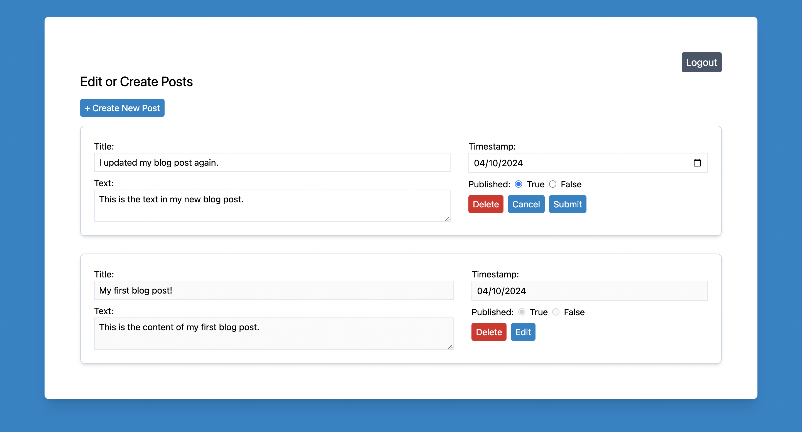
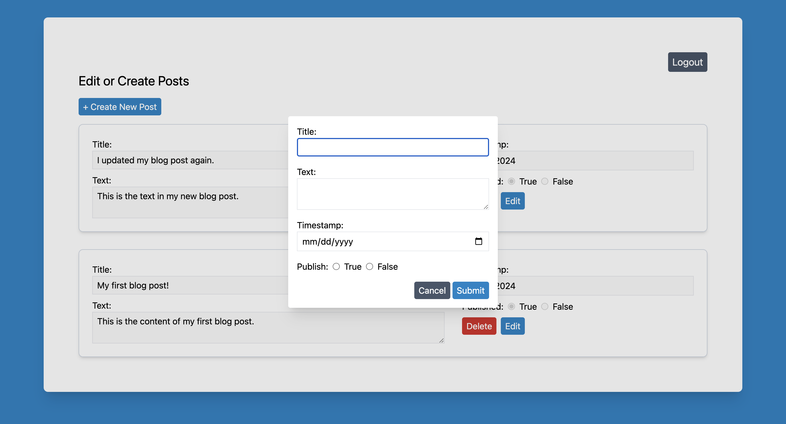

# blog-admin

This is the admin interface for a blog that requires authentication to create, delete, and edit posts. It's built with React, TypeScript, and Tailwind CSS. It consumes an API I built for creating and sharing posts.

Refer to [blog-api](https://github.com/ken-ux/blog-api) for the backend and [blog-frontend](https://github.com/ken-ux/blog-frontend) for the user interface.

Live version can be found here: https://blog-admin-ken.netlify.app/

**Note**: Currently, there's no admin login for public use.

## Features

After logging in, the admin's user ID is used to find posts associated with their account. This means that this interface and its accompanying API can be used to manage multiple blogs since each blog would have a separate admin profile. Screenshows below show what the interface looks like:

|                       Default View                        |                        Post Creation                        |
| :-------------------------------------------------------: | :---------------------------------------------------------: |
|  |  |

## Lessons Learned

- An issue I had was the login form not receiving a success response despite entering the correct credentials.
  - I sent console logs from the server to see what was being submitted and it showed nothing being received when the form was being submitted. I figured out that I was not sending the form data in the correct format, and therefore it could not be processed by the server. Transforming the data from a `FormData` object into a `URLSearchParams` object was the solution.
- Another issue was the frontend being unable to access protected API routes, despite successful login and acquiring a JWT from the backend.
  - I realized that I was not storing the token anywhere on the client when I received it from the backend. Without it being stored, I couldn't supply the token when trying to access protected routes. My solution was to save the token to local storage when it was received.
  - As a side note, the token has an expiration set on the backend, so storing the token doesn't mean an admin would have permanent access.
- I learned to send HTTP requests with an Authorization header containing the JWT to access protected API routes.
  - In the future, I'd try out saving the token in a cookie for a more elegant implementation. The cookie would get sent with each network request to the API, which is much more simple than me manually sending the token in a header each time.
